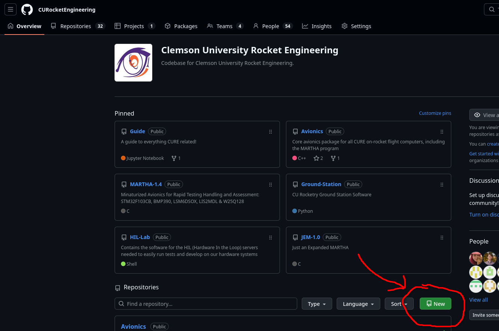
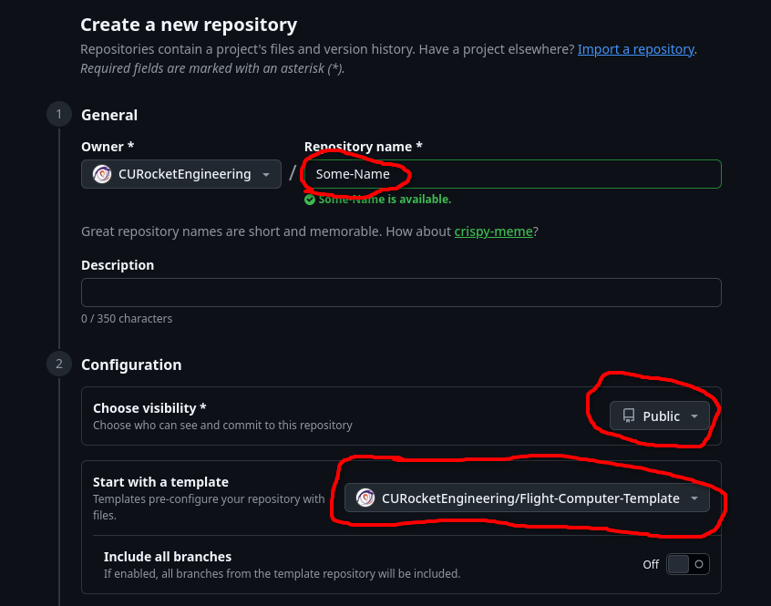
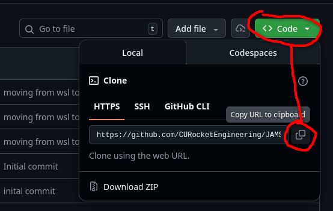

# Flight Computer Template (FTC)
The Flight Computer Template (FTC) is meant to be a simplified version of the much beloved [MARTHA 1.4](https://github.com/CURocketEngineering/MARTHA-1.4) and [JEM 1.0](https://github.com/CURocketEngineering/JEM-1.0), which happens to be the intial source of FTC, that allows software engineers to springboard their rocketry software for certifications computers, Clemson Tiger Takeoff (TTO), and personal projects. Implemented with [platform.io](https://platformio.org/), the FTC is able to store all of your required sensors, microcontrollers, and other programmable in a constantly updated form. In addition to this, the FTC is able to call upon the functions from the [Avionics](https://github.com/CURocketEngineering/Avionics) repository, which allows many useful additions and unique ways of data gathering.

# Template Usage Insturctions

1. Start by heading to the [CURocketEngineering GitHub organization](https://github.com/CURocketEngineering) 
2. Click on "New" to make your own repository. 
3. Give your repo a name using title case and hyphens, such as "My-Flight-Computer". 
4. Make the repo public
5. Select "Flight-Computer-Template" as the template repository. 
6. Finally, click "Create Repository" at the bottom. 

# Workspace Setup

Now that you have a repo, we need to clone it locally and set up your workspace. 

## Required Software to Download
1. Download Git: https://git-scm.com/downloads
	- After you finish the download and setup, type `git` in your terminal to see if it's recognized
	- We use GitHub to version control all of our code on the cloud
	- Git is the program to copy the remote code locally and push edits up to the cloud
2. Download vscode: https://code.visualstudio.com/  
   - VS Code is our IDE of choice because of integration with PlatformIO IDE, popularity,
    and widespread usage in industry. 
3. Install PlatformIO Extension: [https://platformio.org/install/ide?install=vscode](https://platformio.org/install/ide?install=vscode)

## Cloning and initializing the repo

1. Clone your repo by heading to your repo on GitHub and clicking the green "Code" button, then copying the URL.

2. In the terminal of your choice, navigate to the directory you want to clone the repo in and type `git clone <paste the URL here>`. This will create a local copy of the repo on your computer.
3. Open the cloned repo in VS Code by typing `code <repo name>` in the terminal. This will open the repo in VS Code.
4. If PlatformIO is installed, it should automatically detect the `platformio.ini` file and begin initializing the workspace. This may take a few minutes as it downloads the necessary libraries and toolchains.

## Avionics Setup

To integrate our Avionics library directly into your project, utilize git submodules via this following commands: 

```bash
git submodule add https://github.com/CURocketEngineering/Avionics.git lib/Avionics
git submodule init
git submodule update
```

## GCC Toolchain Setup

If you are on Windows, and do not have the GCC toolchain installed, you can follow [the directions from VSCode](https://code.visualstudio.com/docs/languages/cpp#_example-install-mingwx64-on-windows)

## Python Install

If you need Python, you can download a Windows installer from [the Python website](https://www.python.org/downloads/). Make sure to check the box that says "Add Python to PATH" during installation. After installation, you can verify that Python is installed by typing `python --version` in your terminal.

## More Help

Our [Guide Repo](https://github.com/CURocketEngineering/Guide/blob/master/pio_environment_setup.md) has more directions on setting up PlatformIO and using it to build and upload code to your microcontroller. You can also contact the **#engr-software** team on Slack. 

The [MARTHA 1.4](https://github.com/CURocketEngineering/MARTHA-1.4) project utilizes the same setup as the FTC, you can reference it for examples of Avionics usage. 

# Developing your Flight Computer

Most of the code you'll need to write will be in the `src/main.cpp` file.
You can also add additional .cpp files to src and headers to include for organization. For example, we put a `include/pins.h` file in the template to store all of our pin definitions. 
You can also add additional libraries to the `platformio.ini` file, and include them in your code.